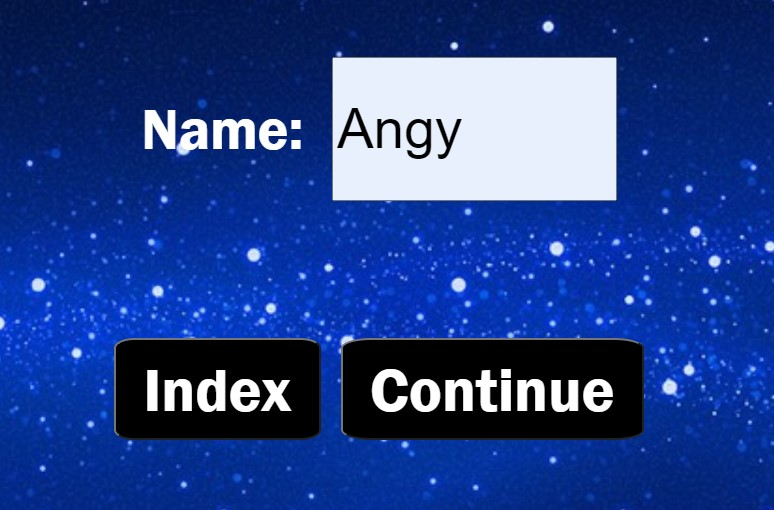

# proyecto3
Mastermind
# Indice
-Estructura 
-Explicación del juego 
-Mejoras pendientes 
-Información de contacto 

# Explicación del juego

El juego Mastermind consiste en adivinar la combinación correcta de colores tanto en posición como en color, antes de que se acaben las rondas  
    El mismo color se puede repetir en más de una celda y por lo tanto puede no existir uno de los colores en la combinación 
    Para comenzar el juego, introducimos un Nickname que se guardará siempre que no volvamos al index.  
    Seleccionamos los colores con los que vamos a jugar y posteriormente será llevado al tablero de juego, donde tendremos 10 rondas para acertar la combinación 
    Introducimos la combinación que creemos ganadora cliqueando en el color elegido y posteriormente cliqueando de nuevo en la primera fila<strong>de abajo a arriba</strong> dependiendo de en qué ronda nos encontremos. Para comprobar si hemos acertado, hacemos click en el botón "check". 
    A la derecha del tablero tenemos unos círculos más pequeños que nos indican en qué estado tenemos nuestra combinación, teniendo en cuenta: 
      -El color <strong>morado </strong> significa que hemos acertado color y posición. 
    -El color <strong>blanco </strong> significa que el color se encuentra en la combinación ganadora pero no está colocado en la posición correcta. 
    <strong>-Si se muestra transparente,</strong> significa que el color no se encuentra en la combinación ganadora.  

# Estructura
<h1>Pantalla de inicio: Mastermind</h1> 

Podemos acceder a las reglas del juego o jugar directamente depende de qué botón pulsemos. 
    En la pantalla "PLAY" nos solicita un Nombre de jugador 
    La siguiente pantalla nos lleva a la selección de color mediante los botones pequeños en los que podemos elegir los colores con los que queremos jugar. 
    Si continuamos por el botón play, nos encontramos con el tablero de juego, que tiene la siguiente estructura 
    Tras el chequeo de las rondas veremos algo como esto, a la derecha vemos señalado el estado de nuestra combinación con los criterios arriba mencionados 
    Si conseguimos adivinar nos lleva a WIN y si se acaban las rondas y no lo adivinamos, nos lleva a LOOSE en los cuales se muestra el nombre inicialmente introducido. Si queremos seguir jugando, desde el botón "play again" nos respeta el nombre introducido y tras seleccionar nuevos colores, se repite el juego con una combinación nueva.

# Mejoras pendientes
-Incluir dos niveles de dificultad más 
-Arreglar responsive en pantallas pequeñas para la página "colorselect.html" 
-el tablero de juego en pantallas pequeñas es bastante incómodo, en un futuro sería interesante pensar en otra disposición más cómoda.

# Información de contacto
>Ángela Ejarque Sánchez --> https://github.com/AngelaEjarque
